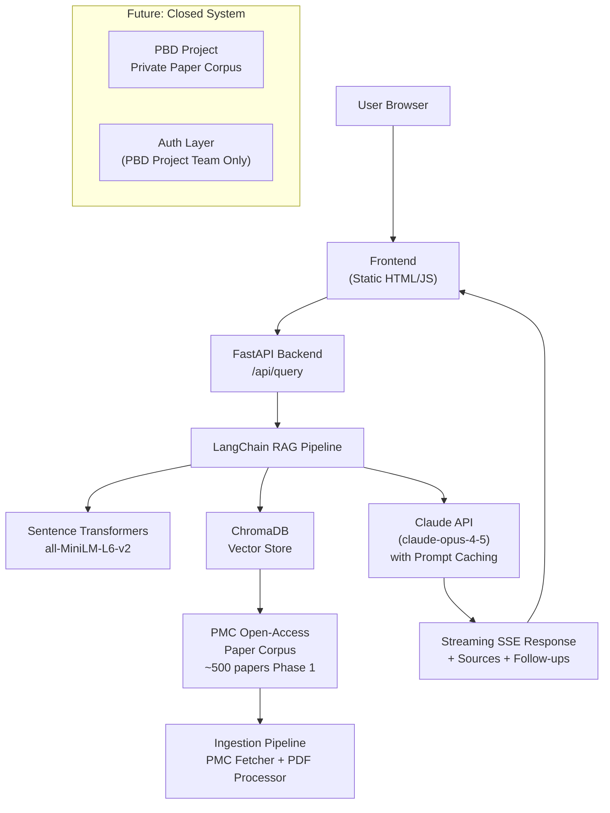

# PeroxiOS Architecture

> System design and data flow for the peroxisome research intelligence platform.

## System Architecture Diagram



## Data Flow

The pipeline follows a standard RAG (Retrieval-Augmented Generation) architecture:

```
ingest → embed → store → retrieve → augment → generate → respond
```

1. **Ingest** — The PMC fetcher searches PubMed Central for peroxisome-related open-access papers using NCBI E-utilities. Papers are downloaded as JATS XML and saved to `data/papers/`.

2. **Embed** — The PDF processor extracts structured text (title, abstract, sections, figure captions) from each paper, skips references and figure images, then chunks the text using LangChain's `RecursiveCharacterTextSplitter` (512 tokens, 64 overlap). Each chunk is embedded with sentence-transformers `all-MiniLM-L6-v2`.

3. **Store** — Chunks and their metadata (paper_title, pmc_id, authors, year, section) are stored in ChromaDB, a lightweight local-first vector database persisted to disk.

4. **Retrieve** — On query, the question is embedded and ChromaDB retrieves the top-k (8) chunks using Maximum Marginal Relevance (MMR) with a fetch pool of 20. MMR reduces redundancy by balancing relevance and diversity.

5. **Augment** — Retrieved chunks are formatted as context with source headers (title, authors, year, PMC ID, section). This context is prepended to the user's question in the prompt to Claude.

6. **Generate** — Claude (claude-opus-4-5) generates the answer, streamed token-by-token via Server-Sent Events. In Explore mode, it uses plain language for patients/families/clinicians. In Deep Dive mode, it includes methodology notes, conflicting evidence, knowledge gaps, and 3 follow-up research questions.

7. **Respond** — The frontend renders the streaming response, an expandable "Sources cited" section (paper titles + PMC IDs), and in Deep Dive mode, clickable follow-up question chips. A confidence note reminds users this is not medical advice.

## Token Optimization Strategy

PeroxiOS uses several strategies to minimize API cost while maximizing answer quality:

- **System prompt caching** — The ~400-token system prompt is sent with `cache_control: {"type": "ephemeral"}`, which caches it on Anthropic's side for 5 minutes. This saves ~90% on system prompt tokens for repeated queries within the cache window. The system prompt rarely changes, so this is the single biggest cost saving.

- **MMR retrieval** — Maximum Marginal Relevance reduces redundant chunks in the context, lowering the input token count for each query. Instead of 8 similar chunks from the same paper, MMR selects 8 diverse chunks across papers.

- **Mode-based token caps** — Explore mode is capped at 1,024 output tokens (sufficient for plain-language summaries). Deep Dive is capped at 4,096 (needed for methodology analysis + follow-ups). This prevents runaway costs on long responses.

- **Chunk size tuning** — 512-token chunks with 64-token overlap balance retrieval precision (smaller chunks = more targeted) against context coverage (larger chunks = more complete sentences). This avoids sending entire papers while preserving semantic completeness.

### Estimated Cost

| Mode | Input tokens (est.) | Output tokens (est.) | Cost per query |
|---|---|---|---|
| Explore | ~3,000 | ~800 | ~$0.002 |
| Deep Dive | ~3,500 | ~3,000 | ~$0.015 |

*Estimates assume 8 retrieved chunks at ~300 tokens each plus the cached system prompt. Actual costs vary with query complexity and corpus size.*

## Closed System Architecture (Future)

Phase 5 introduces a dual-corpus architecture for PBD Project internal use:

- **Public corpus** (`peroxios_public`): PMC-OA papers, open access, serves all public queries. No authentication required.

- **Private corpus** (`peroxios_private`): PBD Project licensed papers (paywalled or restricted-access), requires authentication via an `X-PBD-Token` header.

### Dual-Collection Design

```
API Request
  ├── corpus: "public"  → ChromaDB collection: peroxios_public
  │                        (PMC-OA papers, no auth)
  └── corpus: "private" → Auth check (X-PBD-Token)
                          → ChromaDB collection: peroxios_private
                          (PBD Project licensed papers)
```

- Separate ChromaDB collections ensure no cross-contamination between open and restricted corpora.
- The API accepts a `corpus` field in the query request body. Private queries require a valid `X-PBD-Token` header verified against an allowlist.
- The ingestion pipeline tags each paper with its corpus (public or private) and routes it to the correct collection.
- Future expansion: per-team collections, per-disease sub-corpora, and user-uploaded reference sets.
